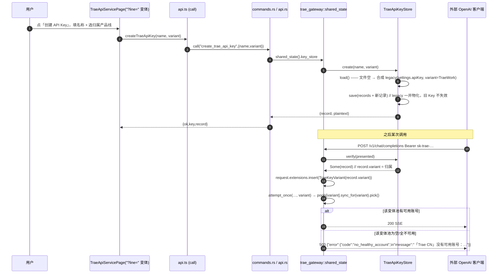
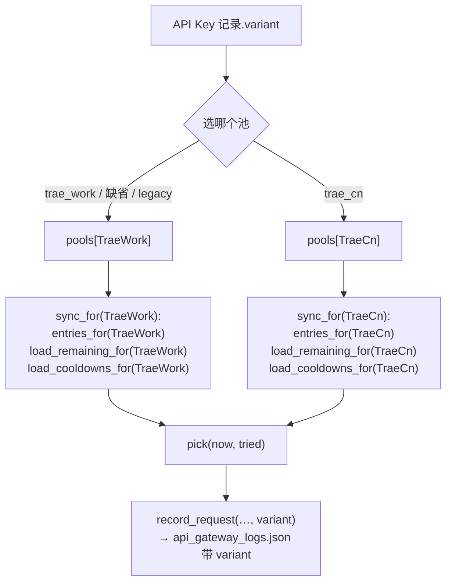
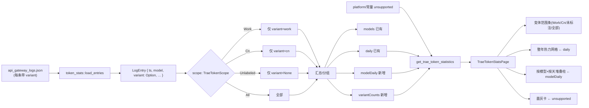
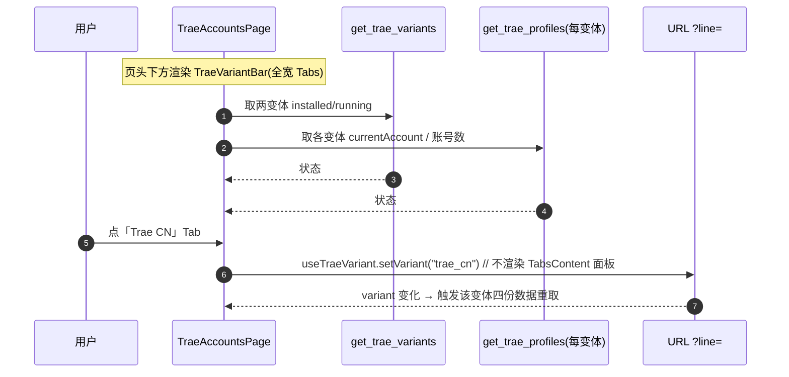
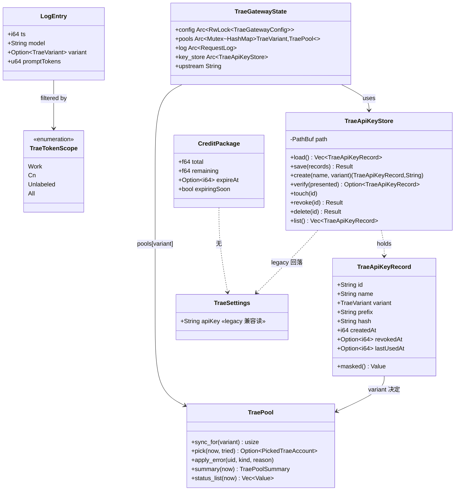
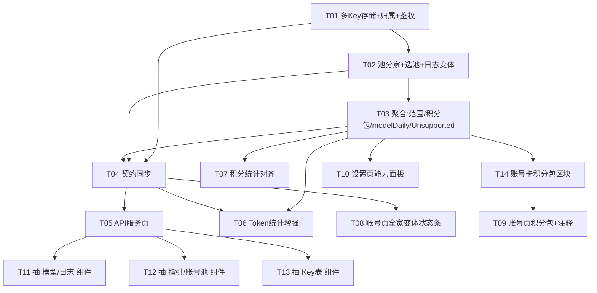

# Trae 对齐 WorkBuddy · 增量架构设计与任务分解

> 输入：`docs/parity/trae-parity-matrix.md`（76 条差距，带 `文件:行号` 证据）+ `.workbuddy/memory/MEMORY*.md`（硬约定）。
> 目标：把 Trae 五页的**交互与功能骨架**补齐到与 WorkBuddy 一致，只统一骨架不搬文案。
> 本文只做设计，**不改任何源码**。所有判定与矩阵编号（G-xxx）或 `文件:行号` 对齐。
> 作者：架构师高见远（software-architect）。
>
> **v2 修订说明（用户拍板）**：推翻 v1 的「Key 不带 variant」取舍 → **Key 完整照搬，含归属产品线**；
> 随之**网关账号池按变体分家**（并修掉一个既有功能洞）；**请求日志加变体维度**以支撑 Token 统计的变体范围条；
> 新增「与 WorkBuddy 的显式差异清单」一节；任务列表 12 → **14 条**。

---

## 0. 结论速览（给工程师的四句话）

1. **Trae 的 API Key 完整照搬 WorkBuddy，含「归属产品线」**（对齐 `api-key-table.tsx:198-211` 的「归属版本」列）。
2. **网关账号池必须按变体分家**：现状 `TraePool::sync()` 只读默认变体（`account::entries()` → `entries_for(TraeWork)`），**只装 Trae CN 账号的用户网关池为空、调用必然失败**——这是本轮一并修掉的既有功能洞。
3. **请求日志加 `variant` 维度**（我们自己记的，进池时已知归属），Token 统计页据此出「变体范围条」；三态是**筛选维度**（另立 `TraeTokenScope`，不得往 `TraeVariant` 加值）。
4. 平台做不到的走 `platform::Unsupported` 形状显式声明；**无真实数据源**与**本轮刻意不做**的，分别进 §3 的「显式差异清单」②③ 类，**绝不返回假成功**。

---

## 1. 实现方案总览与关键取舍

### 1.1 分层与改动面

```
后端聚合与契约（Rust：core + gateway + server + src-tauri）
        │  先把「Key 存储/池分家/聚合/命令契约」钉死
        ▼
前端页面（React：五页 + types + api.ts）
        │  页面只消费已定型的契约
        ▼
组件收口（React：把内联区块抽成 Trae 专用组件，消除漂移）
```

### 1.2 取舍一：多 Key **完整照搬**，Key 记录**带归属产品线**

**用户决策（不可再推翻）**：Trae 的 API Key 支持「归属产品线」，对齐 WorkBuddy 的「归属版本」列。

Key 记录形状（对齐 `crates/buddy-switch-gateway/src/apikey.rs:16-45` 的 `ApiKeyRecord`，但把 `region: Region` 换成 `variant: TraeVariant`）：

```rust
#[serde(rename_all = "camelCase")]
pub struct TraeApiKeyRecord {
    pub id: String,
    pub name: String,
    /// 归属产品线。**缺省 = TraeVariant::default() = TraeWork**（见下方两条零回归前提）。
    #[serde(default, serialize_with = "variant_as_str", deserialize_with = "variant_from_str")]
    pub variant: TraeVariant,
    pub prefix: String,
    pub hash: String,
    pub created_at: i64,
    pub revoked_at: Option<i64>,
    #[serde(default)]
    pub last_used_at: Option<i64>,
}
```

**两条零回归前提（务必写进代码注释与单测）**：

1. `variant` 字段 `#[serde(default)]`，缺省值 **`TraeVariant::default()` = `TraeWork`**（`variant.rs:121-130`）。
   → 老用户的 `api_gateway_keys.json` 若已有记录但无 `variant` 键，读出来即 `TraeWork`，行为不变。
2. **legacy 记录归属 = `TraeWork`**：由 `settings.apiKey` 合成的旧 Key 记录，`variant` 必须落 `TraeWork`。
   理由：现有用户全部走 `TraeWork` 池（`pool.rs:211` 的 `account::entries()`），legacy Key 归 `TraeWork` 才能让**升级前后逐字节一致**。
   这是 R1（升级即 401）之外的**第二个零回归前提**。

**序列化口径**：`TraeVariant` 枚举派生的 serde 是 `#[serde(rename_all="lowercase")]` → 会得到 `"traework"`，**不匹配**前端 `TraeVariantId = "trae_work"|"trae_cn"`。因此记录里的 `variant` 必须用 `as_str()`（`variant.rs:83-88`）序列化为 `"trae_work"/"trae_cn"`、用 `TraeVariant::parse`（`variant.rs:105-113`）反序列化。**这是前端能读对归属列的前提。**

**前端差异**：WorkBuddy 的创建对话框「归属版本」Select 用 `REGIONS`（`api-key-table.tsx:198-211`）；Trae 版用 `TraeVariant::all()` 对应的两个产品线（`trae-variant-switch.tsx` 同源文案），**位置与骨架照搬，选项内容按 Trae 实情**。

### 1.3 取舍二：网关账号池**按变体分家**（本轮必须，修既有功能洞）

**既有功能洞（team-lead 指出，已复核）**：`TraePool::sync()` 调 `account::entries()`（`gateway/src/trae/pool.rs:211`），而它是 `entries_for(TraeVariant::default())`（`core/src/modules/trae/account.rs:185-188`），`TraeVariant::default()` = `TraeWork`（`variant.rs:127-129`）。
**后果：只装了 Trae CN 账号的用户，网关池恒为空，`pick` 永远返回 `None`，调用必然失败。**

**改法**：

- `TraeGatewayState` 的 `pool: Arc<Mutex<TraePool>>` 改为按变体分家：

  ```rust
  /// 按产品线分家的账号池：Key 的归属决定用哪个池。
  /// 用 `HashMap<TraeVariant, TraePool>` 而非「一个池 + 每条目带 variant」：
  /// - 两条产品线的账号库、冷却文件、积分缓存**本就分家**（`*_for(variant)`），
  ///   分成两个池可以各自 `sync`，不必在选号里再过滤；
  /// - 避免「同一 uid 在两条线是两个不同账号」被错误合并（`account.rs:209-210`）。
  pub pools: Arc<Mutex<HashMap<TraeVariant, TraePool>>>,
  ```
  `TraeVariant` 已派生 `Hash + Eq + Copy`（`variant.rs:69`），可安全作 key。

- `TraePool` 新增 `sync_for(&mut self, variant: TraeVariant)`：把 `entries()`/`load_remaining()`/`load_cooldowns()` 换成 `entries_for(variant)`/`load_remaining_for(variant)`/`load_cooldowns_for(variant)`。
  **设备标识不用改**：`device::derive(uid)` 是 uid 的纯函数、与变体无关（`device.rs:142-147`），池里不需要 `ensure_for_variant`。

- **鉴权层解析归属并透传**：`bearer_auth` 中间件 `verify(presented)` 拿到 `record` 后，把 `record.variant` 写进请求扩展（`request.extensions_mut().insert(TraeKeyVariant(variant))`），`chat_completions` 读出后传入 `stream_chat/aggregate_chat → attempt_once(state, …, variant, …)`，只从 `state.pools[variant]` 选号；`settle/settle_failure` 的 `record_request` 也写同一个 `variant`。
  用「请求扩展」而非给每个 handler 加参数，避免中间件→handler 的签名穿透。

- **空池文案必须指向该产品线**（不复用旧文案，否则 Trae CN 用户看到误导信息）：

  ```rust
  // no_account_failure_sync(state, variant)
  // 文案示例：「Trae CN」没有可用账号：{diagnose 逐账号原因}。
  //          请在「账号管理」切到 Trae CN 添加账号，或在「一键签到」查看冷却原因。
  format!("「{}」没有可用账号：{}。请在「账号管理」切到 {} 添加账号，或在「一键签到」查看冷却原因。",
          variant.display_name(), diagnose.join("、"), variant.display_name())
  ```
  旧文案里的「请先在『账号管理』中添加 Trae 账号」是**变体无关**的，对只装 CN 的用户是误导（他会去工作区默认的 Work 分区找）。

- **WorkBuddy 网关零影响（R6 仍成立）**：本改动只在 `crates/buddy-switch-gateway/src/trae/**` 与 Trae 专用的 `src-tauri/src/trae_gateway.rs`；WorkBuddy 走独立 `crate::gateway`（`gateway_host::shared_state()`）与独立 `OnceLock`（`src-tauri/src/trae_gateway.rs:1-17`），**两套 `OnceLock` 保持分离，不合并**。

- **管理面 `status_view` 加 `variant` 入参**（默认 `TraeWork`）：池摘要/账号明细/`diagnose` 针对该变体的池计算（`trae/mod.rs:404-443` 的 `status_view` 签名加 `variant: TraeVariant`）。响应**有线形状不变**（键集合不变，`trae/mod.rs:610-633` 的护栏测试仍通过）。调用点：`commands.rs:1440`（`trae_gateway_status(variant)`）、`api.rs` 的 `/api/trae/gateway/status`（可选 query `variant`）。API 服务页把页头 `?line=` 的变体传下去（`TraeApiServicePage.tsx:290` 已有 `TraeVariantSwitch`）。

**归属 → 池 对应关系表**：

| Key 的 `variant` | 使用哪个池 | 数据源 |
|:--|:--|:--|
| `trae_work`（含缺省/default） | `pools[TraeWork]` | `entries_for(TraeWork)` + `load_remaining_for(TraeWork)` + `load_cooldowns_for(TraeWork)` |
| `trae_cn` | `pools[TraeCn]` | `entries_for(TraeCn)` + `load_remaining_for(TraeCn)` + `load_cooldowns_for(TraeCn)` |
| 无归属记录（旧文件缺 `variant` 键） | `pools[TraeWork]`（serde default） | 同 `trae_work` 行 |
| legacy 合成记录（来源 `settings.apiKey`） | `pools[TraeWork]` | 同 `trae_work` 行 |

### 1.4 取舍三：Token 统计的「变体范围条」≠「变体合并」

**本轮做**：给 `LogEntry`（`core/src/modules/trae/token_stats.rs:113-122`）加 `variant: Option<TraeVariant>` 字段，`#[serde(default)]` → 旧日志读出 `None`。网关在**记录日志时**写入归属产品线（§1.3 已把变体透传到 `record_request`）。Token 统计页据此出「变体范围条」，与截图同形。

三态是**筛选维度**，**另立类型**（不得往 `TraeVariant` 加值，`MEMORY.md §一`）：

```rust
/// Token 统计的变体查询范围（**筛选维度**，非第三种变体）。
#[derive(Debug, Clone, Copy, PartialEq, Eq, Default)]
pub enum TraeTokenScope { Work, Cn, Unlabeled, All }
impl Default for TraeTokenScope { fn default() -> Self { Self::All } }
```

- **旧日志（`variant: None`）归类为「未标注」**，范围条**必须给出该档**（`Unlabeled`），**不得静默丢弃**；`All` ＝ Work ∪ Cn ∪ Unlabeled。
- 后端 `get_statistics(days, scope)` 按 scope 过滤，并在载荷里回传各档计数 `variantCounts: { work, cn, unlabeled, all }`，供范围条显示徽标。

**为何这与 v1 §1.3 拒绝的「变体合并」不是同一件事**：

| 维度 | Token 范围条（**做**） | 变体合并（**不做**） |
|:--|:--|:--|
| 数据源 | 本机网关日志——**我们自己记的**，每条已带归属 | 两条**独立账号库**的 accounts/cooldowns/credits/history/checkin 四份数据 |
| 操作 | 对**单一来源**做**过滤** | 对**两个来源**做**跨库聚合** |
| 键冲突 | 无（日志里 uid+变体唯一） | 有：同一 `user_id` 在两条线是**两个不同账号**（`account.rs:209-210`），强行合并语义会串 |
| 成本/风险 | 低（加字段 + 过滤） | 高（三态筛选 × 四份数据的默认值与去重） |

**裁定**：二者**分开**——范围条本轮做；账号/积分的四份数据跨变体合并**本轮不做**（见 §3 类③）。

### 1.5 取舍四：组件**不做跨产品线合并**，做 Trae 专用平行组件

WorkBuddy 的 `gateway/*` 五组件是 store + region 耦合的，不能直接复用：

| WorkBuddy 组件 | 耦合点 | 证据 |
|:--|:--|:--|
| `gateway/model-list.tsx` | `useGatewayStore(s=>s.models[region])` + `REGIONS` Tabs | `model-list.tsx:31-34,55-63` |
| `gateway/request-log.tsx` | `useGatewayStore` + `regionDescriptor(entry.region)` | `request-log.tsx:33-35,83` |
| `gateway/api-key-table.tsx` | `useGatewayStore` + `归属版本` Select + `REGIONS` | `api-key-table.tsx:35-38,198-211` |

直接复用会把 WorkBuddy 的 `useGatewayStore`、`Region` 拖进 Trae 页面，正是要消除的漂移。**裁定**：新建 **Trae 专用平行组件**（骨架/类名照搬，数据契约按 Trae 实情），落 `src/components/gateway/trae-*.tsx`。见 §3 类③「组件跨产品线合并：本轮不做」。

### 1.6 多 Key 的**存储与旧→新兼容读**（防 401 的核心）

- **存储**：新文件 `~/.buddy-switch/trae/api_gateway_keys.json`（数组），**只存 `sha256` 哈希 + 前缀**，明文仅创建时返回一次。明文格式保持 `sk-trae-<32hex>`（与现有 `generate_api_key()` 一致，`trae/mod.rs:321-324`），前缀 `sk-trae-<前4位>`。
- **旧文件**：`~/.buddy-switch/trae/settings.json` 的 `apiKey` 是**字符串**（`settings.rs:69-71`）。多 Key 化后必须能读旧文件，否则老用户升级后网关鉴权直接失效、调用全 401。
- **兼容策略（惰性物化，零破坏）**：
  1. `key_store.load()`：先读 `api_gateway_keys.json`；**若文件缺失/为空/解析失败**，回落 `settings::load().api_key`——非空则合成一条 legacy 记录（`id="legacy"`，`variant=TraeWork`，`hash=sha256(api_key)`，`prefix=mask_api_key(api_key)`，`name="旧版 Key（升级迁移）"`）。
  2. **不改写 `settings.json`**：`apiKey` 原地保留作兼容读。本次改动**不触碰任何既有用户文件**，因此 `MEMORY.md §六`「改写用户数据前必须先备份」**不触发**（`api_gateway_keys.json` 是新增文件）。
  3. **物化时机**：任何写操作（create/revoke/delete）在 `load()` 得到含 legacy 记录的列表后 `save()`，legacy 一并落盘——**旧 Key 不会因用户新建一把 Key 而失效**。
  4. `bearer_auth` 改为 `key_store.verify(presented)`：legacy Key 与新 Key **同时有效**，升级后老客户端无需改配置。
- 旧 Key 一旦被 **revoke**，即写入 `api_gateway_keys.json`（`revokedAt` 非空）并从此以文件为准——「显式作废」的正确语义。

### 1.7 契约同步纪律（`MEMORY.md §二`，违反即静默失败）

新增/改动命令**必须同步 4 处 + 类型 + 演示**：

| # | 位置 | 内容 |
|:--|:--|:--|
| ① | `src/lib/api.ts` | `ROUTES` + wrapper（**裸 `call("命令名")` 字面量**，不得用字符串变量拼命令名，否则 `check:api` 静默漏检） |
| ② | `src-tauri/src/lib.rs` | `invoke_handler![…]` |
| ③ | `crates/buddy-switch-server/src/api.rs` | `.route(path, method(handler))` |
| ④ | `src-tauri/src/commands.rs` | `#[tauri::command]` 函数体 |
| ⑤ | `src/lib/trae-types.ts` | TS 类型 |
| ⑥ | `src/lib/api.ts` 的 `DEMO_READ_COMMANDS` + `src/lib/screenshot-demo.ts` | 只读命令补 case，否则演示站白屏（`check-api-contract.cjs:249-256`） |

两条通道返回形状必须一致。为消除漂移，**keys 响应拼装收敛到 gateway crate 的 `trae::apikey::{list_response, create_response}`**（对应「聚合/错误文案只写一处」原则，`handlers.rs:1-17`）。

---

## 2. 数据可得性终裁表

### 2.1 B 类（10 条）逐条落定——「新字段从哪个源算出来」

| 编号 | 能力 | 裁定 | 取数路径 / 落地 |
|:--|:--|:--|:--|
| G-A03 | 自动签到定时 ↔ 跳过已签到 | **2026-09-22 改为真做**（原裁定「保持现状 / 语义替身」作废） | 新增排程任务 `trae_checkin`（`schedule.rs` 的 `define_schedule_tasks!` 一行 + `trae::handlers::run_scheduled_checkin`）：到点触发 + 进程启动补跑，两个区域各签一轮；开关与小时表在 Trae 设置页「自动签到」组，账号页工具栏另有同名开关（与 WB 同位同义）。⚠️ **默认关闭**（新增能力、会对外发请求，故 opt-in）。`TraeAccountsPage.tsx` → `save_trae_settings{checkinSkipChecked}` 仍保留，但语义收窄为「批量签到策略」 |
| G-A06 | 账号卡**积分包进度条** | **可行，落地** | 源：`user_entitlement_pack_list`（每包 `entitlement_base_info.quota.credits_limit`、`usage.credits_amount`、`expire_time`、包名）。`credits::calc_remaining_credits`（`credits.rs:572-648`）当前只算聚合与**最早到期**、**丢弃逐包明细** → 扩展为同时返回 `Vec<CreditPackage>`，持久化进 `remaining.json` 新字段 `packages`，经 `credits_overview_for` 透出 |
| G-T05 | 「Token 活动」整年热力网格 | **可行，前端即可** | 源：`LogEntry.ts` + 已有 `by_date → daily`（`token_stats.rs:256,284`）；热力网格直接渲染 `daily`（空日由前端补齐），**无需新后端字段** |
| G-T06 | 「用量分布」按项目 / 按模型 Top8 | **拆分** | 按模型 Top8 = **A**（已实现 `token_stats.rs` 的 `models`）；**按项目 = C**（§2.2） |
| G-P04 | `AccountStrategyCard` ↔ 账号池卡 | **语义不同，保持各自** | Trae 无 `accountStrategy` 后端契约（`lib.rs:215-216` 无 Trae 对应），以「账号池 + `diagnose`」表达（`TraeApiServicePage.tsx:454-551`） |
| G-B-15 | `get/save_auto_checkin_config` ↔ `save_trae_settings` | **保持现状** | `checkinSkipChecked` 已真实生效（须保持「被谁读」可 grep，`MEMORY.md §五`） |
| G-B-22 | `get_credit_statistics` ↔ `get_trae_credits` | **保持各自形状** | 数据源不同（签到快照 vs `credit_usage`）；对齐字段只得到恒 0 键 |
| G-B-23 | `get_token_statistics` ↔ `get_trae_token_statistics` | **保持各自形状 + 新增变体范围** | 在**新增聚合**（热力/堆叠/变体范围）上补齐，其余不动 |
| G-B-26 | `get/save_account_strategy` | **不做** | Trae 无策略文件；账号池卡即表达 |
| G-B-32 | `open_accounts_dir` 等 ↔ 打开 Trae 数据目录 | **纳入本轮，P2** | 新增 `open_trae_data_dir(variant?)`（非 Windows 返回结构化 `Unsupported`，参照 `platform.rs:940-959`） |

### 2.2 C 类（17 条）逐条落定——「Unsupported 返回形状 + 界面表达」

统一形状（沿用 `platform::Unsupported`，`platform.rs:44-81`，camelCase）：

```json
{ "capability": "project_dimension", "label": "按项目维度统计",
  "supportedOn": "—", "reason": "Trae 网关日志无稳定项目/会话标识：session_id 每请求新生成" }
```

对**本应返回数据**的接口（如 Token 统计），不报错，而在载荷里带 `unsupported: [ … ]` 数组，界面渲染为置灰卡片/`CapabilityBadge`。

| 编号 | 能力 | capability 标识 | 为什么做不到（证据） | 界面表达 |
|:--|:--|:--|:--|:--|
| — | 缓存读取/写入/命中率 | `cache_metrics` | `LogEntry` 无 cache 字段（`token_stats.rs:113-122`）；`gateway/src/trae/` 全目录无 cache；上游不回传 | Token 统计页置灰卡「缓存命中率 · 平台不支持」+ reason |
| G-T06/G-C03/G-C04 | 按项目分组 / 最贵会话 / 官方积分按模型 | `project_dimension` / `session_cost` / `official_credit_by_model` | `payload.rs:144-147` 的 `session_id`/`project_id` 是**每请求新生成的 `uuid_like()`**；Trae 积分只来自签到快照（`credits.rs:572-648`） | Token 统计「按项目」置灰；积分统计「官方积分消耗」不渲染 + 说明 |
| G-A04 | 自动旅行（派猫猫） | `auto_travel` | `TraeAccountsPage.tsx:80` 明示不存在 | **不渲染**该开关 |
| G-A05 / G-B-21 | CodeBuddy CLI / IDE 接入 | `codebuddy_cli` | CodeBuddy 属 WorkBuddy 生态（`lib.rs:157-162`） | **不渲染**该折叠卡 |
| G-A08 / G-C-06 / G-B-10 / G-B-11 / G-B-09 | 会话列表 / 复制会话 / 记忆·连接器迁移 / 切换进度流 | `session_tree` / `account_data_migration` / `switch_progress_stream` | Trae 登录态是 `Cloud-IDE-JWT` 文件集，无会话树/记忆/连接器对象；切换为文件级快照替换（`switch-account-dialog.tsx` 不被 Trae 引用） | Trae 侧**不出现** `switch-account-dialog.tsx`；切换用行内 busy |
| G-T02 | 产品来源多 Tabs（CLI/IDE） | `multi_source_tabs` | Trae 只有本机网关一个数据源（`token_stats.rs:1-17`） | 单源即无 Tabs；保留数据源 Alert（`TraeTokenStatsPage.tsx:204-217`）**必须保留** |
| G-B-16/17/19 | 定时任务 / 自动轮换 | `scheduler` | Trae 侧无调度器（`TraeAccountsPage.tsx:78-79`） | 不出现「自动」开关；用「跳过已签到」 |
| G-B-20 | GitHub 配置 | `github_config`（非 Trae 差距） | 全局共用项 | 保持全局可用，**不计为 Trae 差距** |
| G-B-30 | 非 Windows 的 MachineGuid 重置 | `machine_guid_reset` | 仅 Windows（`platform.rs:940-959`） | 已有：结构化 `Unsupported` + `CapabilityBadge` 置灰（`TraeSettingsPage.tsx:1205`） |
| G-P03 / G-C-07 / G-B-25 | 多 Key + 归属产品线绑定 | — | **用户拍板照做** | 出 Trae 版 `ApiKeyTable`（**含归属产品线列**，§1.2） |

> **不使用「成功」冒充**：C 类要么界面不渲染，要么返回带 `supportedOn/reason` 的 `Unsupported`，**绝不在两层通道上返回 `ok:true`**（`platform.rs:13-15` / `MEMORY.md §八`）。

---

## 3. 与 WorkBuddy 的显式差异清单（三类，不得混列）

> 本节可直接交付用户。三类互相独立，**不可合并叙述**。

### 类① 平台不可能（走 `Unsupported` 形状，共 6 条）

| # | 能力 | 原因 | 证据 |
|:--|:--|:--|:--|
| 1 | 缓存读取/写入/缓存命中率 | Trae 上游不返回 cache 字段，网关日志无从记录 | `token_stats.rs:113-122`；`gateway/src/trae/` 全目录无 cache |
| 2 | 按项目维度统计 | 网关日志的 `project_id`/`session_id` 是每请求新生成的 `uuid_like()`，不对应客户端项目 | `payload.rs:144-147` |
| 3 | 「调用最贵的会话」 | 同上：无稳定会话标识，无法归并成会话成本 | `payload.rs:144-147` |
| 4 | 自动旅行（派猫猫） | Trae 无该活动接口 | `TraeAccountsPage.tsx:80` |
| 5 | CodeBuddy CLI / IDE 接入 | CodeBuddy 属 WorkBuddy 生态，Trae 无此客户端 | `lib.rs:157-162` |
| 6 | 会话列表 / 复制会话 / 记忆·连接器迁移 / 切换进度流 | Trae 登录态是文件集，无会话树/记忆/连接器对象 | `switch-account-dialog.tsx` 不被 Trae 引用；`lib.rs:172-175` |

### 类② 无真实数据源，故不提供该交互（共 2 条，**非 Unsupported**）

| # | 交互 | 原因 | 证据 | 落地 |
|:--|:--|:--|:--|:--|
| 1 | 网关模型清单「手动刷新」 | Trae 无上游 `/v1/models`，模型名是**客户端侧常量**，刷新必然永不改变结果（属项目禁的「假控件」） | `routes.rs:126-132` | **不加刷新按钮**；模型区保留清单 + 一行说明「Trae 模型为客户端常量，不随上游刷新」 |
| 2 | 积分「明细 / 请求用量」内部分栏 | Trae 积分来自签到快照，**不存在「产生这些积分的请求用量」这一口径的数据源** | `credits.rs:572-648`；`lib.rs:215-216` 无 Trae 对应 | 单栏「积分明细」+ 口径说明，不加空 Tabs |

### 类③ 本轮刻意不做（共 2 条）

| # | 不做的事 | 原因 | 证据 / 备注 |
|:--|:--|:--|:--|
| 1 | 账号/积分的**变体合并**（cross-variant 聚合四份数据） | 需另立 `VariantFilter` 三态 + 跨两条独立账号库聚合 accounts/cooldowns/credits/checkin；键冲突（同 uid ≠ 同账号）语义会串，收益低于噪声；本轮只做「Token 日志的变体范围条」（§1.4） | `handlers.rs:43/72/113` 全为 `*_for(variant,…)`；`account.rs:209-210` |
| 2 | **组件跨产品线合并**（复用 WorkBuddy 的 `gateway/*`） | 那 5 个组件是 `useGatewayStore`+`Region` 耦合的，复用会把 WB 的 store/region 拖进 Trae 页 | `model-list.tsx:31-34`；`request-log.tsx:33-35`；`api-key-table.tsx:35-38` |

---

## 4. 文件清单

### 4.1 新建

| 路径 | 职责 |
|:--|:--|
| `crates/buddy-switch-gateway/src/trae/apikey.rs` | Trae 多 Key 存储（hash+前缀+**归属变体**、legacy 兼容读、create/verify/revoke/delete/list）与两条通道共用的响应拼装 |
| `src/components/gateway/trae-api-key-table.tsx` | Trae 版 Key 表（**含归属产品线列**；创建/吊销/删除/一次性明文） |
| `src/components/gateway/trae-model-list.tsx` | Trae 版模型清单（单变体、**无假刷新**、含常量说明） |
| `src/components/gateway/trae-request-log.tsx` | Trae 版请求日志（元数据 + 清空；可显示归属变体） |
| `src/components/gateway/trae-integration-guide.tsx` | Trae 版接入指引（单 Base URL，无 region Tabs） |
| `src/components/gateway/trae-account-pool-card.tsx` | Trae 版账号池卡（替代内联，五态计数 + diagnose） |
| `src/components/trae-variant-bar.tsx` | **账号页全宽变体状态条**（两行 Tab；变体由 URL `?line=` 承载） |

### 4.2 修改

| 路径 | 职责 |
|:--|:--|
| `crates/buddy-switch-gateway/src/trae/mod.rs` | 声明 `apikey` 模块；`TraeGatewayState` 的 `pool` → `pools: HashMap<TraeVariant, TraePool>`、加 `key_store`；`status_view` 加 `variant` 入参；`ensure_api_key` 语义更新 |
| `crates/buddy-switch-gateway/src/trae/pool.rs` | `sync()` → `sync_for(variant)`；`no_account_failure_sync` 的变体化文案 |
| `crates/buddy-switch-gateway/src/trae/routes.rs` | `bearer_auth` 改 `key_store.verify` 并把 `record.variant` 写进请求扩展；`chat_completions`/`stream_chat`/`aggregate_chat`/`attempt_once`/`settle*`/`record_request` 透传 variant；`status` 读 query `variant` |
| `crates/buddy-switch-core/src/modules/trae/paths.rs` | 新增 `api_gateway_keys_file()` |
| `crates/buddy-switch-core/src/modules/trae/settings.rs` | `api_key` 保留为**兼容读**并加注释（不得删字段） |
| `crates/buddy-switch-core/src/modules/trae/credits.rs` | `calc_remaining_credits` 增逐包明细；`RemainingCache` 加 `packages`（全 `#[serde(default)]`） |
| `crates/buddy-switch-core/src/modules/trae/token_stats.rs` | `LogEntry` 加 `variant: Option<TraeVariant>`（`#[serde(default)]`）；新增 `TraeTokenScope` + 按 scope 过滤 + `variantCounts` + `modelDaily` + `unsupported` |
| `crates/buddy-switch-core/src/modules/trae/handlers.rs` | `credits_overview_for` 透出 `packages`；`token_statistics(days, scope)`；新增 `unsupported_note()`；新增 `open_data_dir(variant)` 转发 |
| `crates/buddy-switch-core/src/modules/trae/platform.rs` | `capabilities()` 的 `unsupported` 增补 Trae 产品级不支持项；新增数据目录定位（供 `open_trae_data_dir`） |
| `crates/buddy-switch-server/src/api.rs` | 删 `regenerate` 路由；加 4 条 keys 路由 + `open-data-dir`；`/api/trae/gateway/status` 接受 `variant`；`/api/trae/token-stats` 接受 `scope` |
| `src-tauri/src/commands.rs` | 删 `regenerate_trae_api_key`；加 4 个 keys 命令 + `open_trae_data_dir`；`trae_gateway_status(variant)`/`get_trae_token_statistics(days, scope)` |
| `src-tauri/src/lib.rs` | `invoke_handler` 同步（删 1 加 5） |
| `src-tauri/src/trae_gateway.rs` | 注释更正（单一 Key / 单池 → 多 Key / 按变体分家） |
| `src/lib/trae-types.ts` | 新增 `TraeApiKeyRecord`（含 `variant`）/`TraeApiKeyCreated`/`TraeCreditPackage`/`TraeModelDailyPoint`/`TraeTokenScope`/`TraeVariantCounts`；扩展 `TraeCreditsOverview`/`TraeAccount`/`TraeTokenStatistics` |
| `src/lib/api.ts` | `ROUTES` 删 1 加 5 + wrapper；`DEMO_READ_COMMANDS` 加 `list_trae_api_keys`；`getTraeTokenStatistics(days, scope)` |
| `src/lib/trae-gateway.ts` | 归一化 `packages`/`modelDaily`/`variantCounts`/`unsupported`（防御性） |
| `src/lib/screenshot-demo.ts` | `list_trae_api_keys` case + 假数据（含两变体）；`get_trae_credits`/`get_trae_token_statistics` 补新字段与两变体日志 |
| `src/pages/TraeApiServicePage.tsx` | 内联区块替换为 Trae 专用组件；Key 表含归属列；模型区去假刷新；传入页头变体给 status；打开数据目录入口 |
| `src/pages/TraeTokenStatsPage.tsx` | 加变体范围条（`TraeTokenScope`）；热力网格（`daily`）；按模型×按天堆叠柱（`modelDaily`）；`unsupported` 置灰卡 |
| `src/pages/TraeCreditsPage.tsx` | 单栏 + 口径说明 + `unsupported` 置灰说明 |
| `src/pages/TraeAccountsPage.tsx` | **页头右侧 `TraeVariantSwitch` → 页头下方全宽变体状态条**（G-A01/A02）；更正 `:77` 过时 OAuth 注释；积分包入口 |
| `src/pages/TraeSettingsPage.tsx` | 「平台能力」面板渲染新增 `unsupported` |
| `src/components/trae-account-card.tsx` | 新增「近期到期」积分包进度条区块（对齐 `account-card.tsx:447-465` 骨架） |
| `src/components/trae-variant-switch.tsx` | 保留供其他四页页头使用（仅账号页改用全宽状态条） |

> **不得触碰**：`Region` / `TraeVariant` 枚举、`settings-primitives.tsx`（两页共用）、WorkBuddy 的 `gateway/*` 五组件。

---

## 5. 数据结构与接口

### 5.1 新增 Rust 结构与 serde 契约

**`crates/buddy-switch-gateway/src/trae/apikey.rs`**（落盘 `~/.buddy-switch/trae/api_gateway_keys.json`）

```rust
/// 单条 Trae API Key（明文不落库）。**含归属产品线**（§1.2）。
#[derive(Debug, Clone, Serialize, Deserialize)]
#[serde(rename_all = "camelCase")]
pub struct TraeApiKeyRecord {
    pub id: String,
    pub name: String,
    /// 归属产品线；缺省 = TraeVariant::default()(TraeWork)。
    /// 序列化用 as_str() 得 "trae_work"/"trae_cn"（前端 TraeVariantId 同形）。
    #[serde(default, serialize_with = "variant_as_str", deserialize_with = "variant_from_str")]
    pub variant: TraeVariant,
    pub prefix: String,   // "sk-trae-a1b2"
    pub hash: String,     // sha256(hex) of full plaintext
    pub created_at: i64,
    pub revoked_at: Option<i64>,
    #[serde(default)]
    pub last_used_at: Option<i64>,
}

pub struct TraeApiKeyStore { path: PathBuf }
impl TraeApiKeyStore {
    pub fn new(path: PathBuf) -> Self;
    /// 读文件；缺失/为空/解析失败 → 回落 legacy（settings.apiKey 合成记录，variant=TraeWork）。
    fn load(&self) -> Vec<TraeApiKeyRecord>;
    fn save(&self, records: &[TraeApiKeyRecord]) -> Result<(), String>;   // 原子写
    /// 生成 `sk-trae-<32hex>`；返回 (record, 明文)；明文仅此一次。
    pub fn create(&self, name: String, variant: TraeVariant) -> (TraeApiKeyRecord, String);
    /// 常量时间比对哈希；无效/不存在/已吊销 → None。返回记录携带 variant。
    pub fn verify(&self, presented: &str) -> Option<TraeApiKeyRecord>;
    pub fn touch(&self, id: &str);                                        // 60s 节流
    pub fn revoke(&self, id: &str) -> Result<(), String>;
    pub fn delete(&self, id: &str) -> Result<(), String>;                 // 仅允许删已吊销
    pub fn list(&self) -> Vec<TraeApiKeyRecord>;                          // 含已吊销
}
/// 两条通道共用（消除形状漂移）。
pub fn list_response(store: &TraeApiKeyStore) -> Value;                  // {keys:[masked…]}
pub fn create_response(store: &TraeApiKeyStore, name: String, variant: TraeVariant) -> Value; // {ok,key,record}
```

**`crates/buddy-switch-gateway/src/trae/mod.rs`（改）**

```rust
pub struct TraeGatewayState {
    pub config: Arc<RwLock<TraeGatewayConfig>>,
    /// 按产品线分家的账号池（§1.3）。
    pub pools: Arc<Mutex<HashMap<TraeVariant, TraePool>>>,
    pub log: Arc<RequestLog>,
    pub key_store: Arc<apikey::TraeApiKeyStore>,   // 替换原 api_key: Arc<RwLock<String>>
    pub started_at: i64,
    pub total_requests: Arc<AtomicU64>,
    pub last_error: Arc<RwLock<Option<String>>>,
    pub http: reqwest::Client,
    pub body_limit_bytes: usize,
    pub upstream: String,
}
/// `status_view` 增 `variant` 入参；响应键集合不变。
pub async fn status_view(state: &TraeGatewayState, running: bool, addr: Option<String>,
                         version: &str, variant: TraeVariant) -> Value;
```

**`crates/buddy-switch-gateway/src/trae/pool.rs`（改）**

```rust
impl TraePool {
    /// 从**指定变体**的磁盘数据重建池（替换原 sync()）。
    pub fn sync_for(&mut self, variant: TraeVariant) -> usize {
        let remaining = credits::load_remaining_for(variant);
        let cooldowns = credits::load_cooldowns_for(variant);
        self.entries = account::entries_for(variant)
            .into_iter()
            .map(|(uid, raw)| { /* device::derive(&uid) 不变（与变体无关） */ })
            .filter(|entry| !entry.jwt.is_empty())
            .collect();
        self.entries.len()
    }
}
```

**`crates/buddy-switch-core/src/modules/trae/credits.rs`（改）**

```rust
#[derive(Debug, Clone, Serialize, Deserialize)]
#[serde(rename_all = "camelCase")]
pub struct CreditPackage {
    pub package_code: Option<String>, pub package_name: Option<String>,
    pub total: f64, pub remaining: f64, pub used: f64,
    pub expire_at: Option<i64>, pub expired: bool, pub expiring_soon: bool, // 7 天内到期
}
// calc_remaining_credits(...) -> (f64, Option<i64>, f64, Vec<CreditPackage>)
// RemainingCache 新增：#[serde(default)] pub packages: HashMap<String, Vec<CreditPackage>>
```

**`crates/buddy-switch-core/src/modules/trae/token_stats.rs`（改）**

```rust
struct LogEntry { /* … 原有字段 … */ , variant: Option<TraeVariant> }  // 从 "variant" 键解析；旧日志 → None

/// Token 统计查询范围（**筛选维度**，不得并入 TraeVariant）。
#[derive(Debug, Clone, Copy, PartialEq, Eq, Default)]
pub enum TraeTokenScope { Work, Cn, Unlabeled, All }   // Default = All

pub fn get_statistics(days: Option<i64>, scope: TraeTokenScope) -> Value;
// 载荷新增：
//   "variantCounts": { "work": u64, "cn": u64, "unlabeled": u64, "all": u64 }
//   "modelDaily": [ {date, model, total, input, output, records} ]
//   "unsupported": [ {capability,label,supportedOn,reason} ]
```

**`crates/buddy-switch-core/src/modules/trae/handlers.rs`（改）**

```rust
pub fn unsupported_note(capability: &str, label: &str, reason: &str) -> Value;  // 唯一来源
pub fn token_statistics(days: Option<i64>, scope: TraeTokenScope) -> Value;
// credits_overview_for 新增键： "packages": { "<uid>": [CreditPackage…] }
pub fn open_data_dir(variant: TraeVariant) -> Result<Value, String>;  // 非 Windows → Unsupported 形状
```

### 5.2 新增 TypeScript 类型（放 `src/lib/trae-types.ts`）

```ts
export interface TraeApiKeyRecord {
  id: string; name: string;
  variant: TraeVariantId;               // "trae_work" | "trae_cn"
  prefix: string; createdAt: number;
  revokedAt: number | null; revoked: boolean; lastUsedAt: number | null;
}
export interface TraeApiKeyCreated { ok: boolean; key?: string; record?: TraeApiKeyRecord; }

export interface TraeCreditPackage {
  packageCode: string | null; packageName: string | null;
  total: number; remaining: number; used: number;
  expireAt: number | null; expired: boolean; expiringSoon: boolean;
}
export interface TraeModelDailyPoint {
  date: string; model: string; total: number; input: number; output: number; records: number;
}
export type TraeTokenScope = "work" | "cn" | "unlabeled" | "all";
export interface TraeVariantCounts { work: number; cn: number; unlabeled: number; all: number; }

// 扩展既有接口：
//   TraeCreditsOverview += packages: Record<string, TraeCreditPackage[]>
//   TraeAccount         += creditPackages: TraeCreditPackage[] | null
//   TraeTokenStatistics += modelDaily: TraeModelDailyPoint[];
//                          variantCounts: TraeVariantCounts; unsupported: TraeUnsupported[]
//   （TraeUnsupported 已存在：trae-types.ts:89-94）
```

### 5.3 新增/改动命令的入参/返回（camelCase）与 4 处登记点

| 命令 | method | path | 入参 | 返回 |
|:--|:--|:--|:--|:--|
| `list_trae_api_keys` | GET | `/api/trae/gateway/keys` | — | `{keys: TraeApiKeyRecord[]}` |
| `create_trae_api_key` | POST | `/api/trae/gateway/keys` | `{name: string, variant: "trae_work"\|"trae_cn"}` | `{ok:true, key:string, record:TraeApiKeyRecord}` |
| `revoke_trae_api_key` | POST | `/api/trae/gateway/keys/revoke` | `{id: string}` | `{ok:true}` |
| `delete_trae_api_key` | POST | `/api/trae/gateway/keys/delete` | `{id: string}` | `{ok:true}` |
| `open_trae_data_dir` | POST | `/api/trae/open-data-dir` | `{variant?: string}` | `{ok:true, path}` 或 `Unsupported` |
| `trae_gateway_status`（改） | GET | `/api/trae/gateway/status?variant=` | `variant?` | 键集合不变 |
| `get_trae_token_statistics`（改） | GET | `/api/trae/token-stats?days=&scope=` | `days?, scope?` | 含 `variantCounts`/`modelDaily`/`unsupported` |
| ~~`regenerate_trae_api_key`~~ | ~~POST~~ | ~~`/api/trae/gateway/key/regenerate`~~ | **删除**（4 处 + 页面引用） | — |

**4 处登记点的精确位置**：

| 位置 | 精确动作 |
|:--|:--|
| `src/lib/api.ts` | 删 `api.ts:233` 的 `regenerate_trae_api_key`；在 `api.ts:234` 前插 4 条 keys 路由 + `open_trae_data_dir`。wrapper：`api.ts:1129-1131` 的 `regenerateTraeApiKey` 换为 `listTraeApiKeys/createTraeApiKey/revokeTraeApiKey/deleteTraeApiKey/openTraeDataDir`。`DEMO_READ_COMMANDS`（`api.ts:96-97`）加 `list_trae_api_keys` |
| `src-tauri/src/lib.rs` | `lib.rs:258` 的 `commands::regenerate_trae_api_key,` 替换为 4 个 keys + 1 个 open-data-dir |
| `crates/buddy-switch-server/src/api.rs` | 删 `api.rs:202-205` 的 `key/regenerate` 路由；在 `api.rs:201` 后加 4 条 keys + `open-data-dir` 路由；`/gateway/status` 与 `/token-stats` handler 读 query |
| `src-tauri/src/commands.rs` | 删 `commands.rs:1455-1467` 的 `regenerate_trae_api_key`；新增 4 个 keys 命令 + `open_trae_data_dir`，均调 `trae_gateway::shared_state().key_store` / `trae::handlers` |

### 5.4 两条通道形状一致性（关键）

`api.rs` 与 `commands.rs` 的同名操作**必须返回同一 JSON**：两者都调 gateway crate 的
`trae::apikey::{list_response, create_response}`（返回 `Value`），**不在通道层各自拼装**——这是 `copy_sessions`
事故（`MEMORY.md §二`）的直接对策。

---

## 6. 程序调用流程（Mermaid）

### 6.1 Key（含归属）创建 → 按归属选池 → 鉴权生效



### 6.2 池分家的数据流（既有洞的修复）



### 6.3 Token 统计：变体范围条 + 新聚合取数



### 6.4 账号页全宽变体状态条（G-A01/A02）



### 6.5 类图



---

## 7. 任务列表（有序、含依赖、按实现顺序）

> 分层：**A 后端聚合与契约（4 条）→ B 前端页面（6 条）→ C 组件收口（4 条）**，共 **14 条**。
> 粒度＝「一次可交付的改动」；每条给「改哪个文件的哪一段 + 可证伪完成判据」。

### 阶段 A · 后端聚合与契约

**T01 多 Key 存储（含归属变体）+ 鉴权改造** — P0
- 依赖：无
- 文件：`gateway/src/trae/apikey.rs`（新建）、`gateway/src/apikey.rs`（`sha256_hex`/`constant_time_eq` 提 `pub(crate)`）、`gateway/src/trae/mod.rs`（`TraeGatewayState` 加 `key_store`、去单 `api_key`）、`gateway/src/trae/routes.rs:88-114`（`bearer_auth` 改 `verify` 并把 `record.variant` 写进请求扩展）、`core/src/modules/trae/paths.rs`（加 `api_gateway_keys_file()`）
- 判据：① 单测证明「旧 `settings.apiKey` 可 verify 且 **合成记录 variant==TraeWork**」+「新建 Key 后旧 Key 仍 verify」+「revoke 后 None」+「磁盘不含明文」+「记录 `variant` 序列化为 `trae_work`/`trae_cn`」。② `cargo test -p buddy-switch-gateway --lib` 全绿。

**T02 网关账号池按变体分家 + 按归属选池 + 日志变体维度** — P0
- 依赖：T01（需 Key 的归属来选池；**两者联合才端到端生效，建议同分支连续提交**）
- 文件：`gateway/src/trae/mod.rs`（`pool` → `pools: HashMap<TraeVariant, TraePool>`；`status_view` 加 `variant`）、`gateway/src/trae/pool.rs`（`sync()`→`sync_for(variant)`；`no_account_failure_sync` 变体化文案）、`gateway/src/trae/routes.rs`（`chat_completions`/`stream_chat`/`aggregate_chat`/`attempt_once`/`settle*`/`record_request` 透传 variant；`status` 读 query `variant`）、`core/src/modules/trae/token_stats.rs`（`LogEntry.variant` 字段解析）、`src-tauri/src/trae_gateway.rs`（注释更正）
- 判据：① 断言「账号库只有 Trae CN 账号 + 归属 TraeWork 的 Key」→ 失败文案**指向 Trae CN 无可用账号**（非 401/500，非通用旧文案）。② 断言「账号库只有 Trae CN 账号 + 归属 Trae CN 的 Key」→ **选号成功**。③ 断言「只有 TraeWork 账号 + legacy Key」→ 行为与升级前一致。④ 日志落盘带 `variant`。⑤ WorkBuddy 网关 e2e 不回归（R6）。

**T03 后端聚合：Token 变体范围 + 积分包明细 + modelDaily + Unsupported** — P1
- 依赖：T02（范围过滤依赖日志里的 variant）
- 文件：`core/src/modules/trae/token_stats.rs`（`TraeTokenScope` + 按 scope 过滤 + `variantCounts` + `modelDaily` + `unsupported`）、`core/src/modules/trae/credits.rs`（`calc_remaining_credits` 增 `Vec<CreditPackage>`；`RemainingCache.packages`）、`core/src/modules/trae/handlers.rs`（`token_statistics(days, scope)`；`credits_overview_for` 透出 `packages`；`unsupported_note`；`open_data_dir`）
- 判据：① 单测：旧日志（无 `variant`）在 `scope=Unlabeled` 下被计入、在 `scope=Work` 下被排除；`scope=All` = 三档之和。② 逐包 total/remaining/expire 正确。③ 旧 `remaining.json`（无 `packages`）读取不 panic。④ `unsupported_note` 字段为 `{capability,label,supportedOn,reason}`。

**T04 命令契约同步（4 处 + 类型 + 演示）** — P0
- 依赖：T01、T02、T03
- 文件：`server/src/api.rs`、`src-tauri/src/commands.rs`、`src-tauri/src/lib.rs`、`src/lib/api.ts`、`src/lib/trae-types.ts`、`src/lib/screenshot-demo.ts`
- 判据：① `npm run check:api` 通过（五方一致）。② 5 条新命令桌面端可达、2 条 webui 路由返回同形。③ 演示站 `list_trae_api_keys` 有假数据、Token 统计假数据含两变体。

### 阶段 B · 前端页面

**T05 API 服务页改造（Key 表含归属列 + 模型静态说明 + 打开数据目录）** — P0
- 依赖：T04
- 文件：`src/pages/TraeApiServicePage.tsx`（删单 Key 卡 `420-452` 与 `onRegenerateKey`；接 `TraeApiKeyTable`；模型区去假刷新加常量说明；传页头变体给 status）
- 判据：① Key 表列＝名称/**归属产品线**/前缀/创建时间/状态/操作，可创建→吊销→删除。② 模型区无刷新按钮，有一行「客户端常量」说明。③ 骨架与 WB 页同构。

**T06 Token 统计页增强（变体范围条 + 热力 + 堆叠柱 + Unsupported）** — P1
- 依赖：T03、T04
- 文件：`src/pages/TraeTokenStatsPage.tsx`
- 判据：① 范围条四档（Trae Work / Trae CN / 未标注 / 全部）计数与 `variantCounts` 一致，切换触发重取。② 热力网格与 `daily` 同源。③ 堆叠柱分母＝总览同期总量。④ 「按项目」「缓存指标」显示 `Unsupported`；**保留**数据源 Alert（`:204-217`）。

**T07 积分统计页对齐（单栏 + 显式差异说明）** — P0
- 依赖：T03
- 文件：`src/pages/TraeCreditsPage.tsx`
- 判据：① 总额＝各账号剩余之和。② 单栏「积分明细」+ 口径说明（无请求用量分栏）。③ 「官方积分消耗按模型」显示差异说明，无假图表。

**T08 账号页全宽变体状态条（G-A01/A02）** — P0
- 依赖：T04
- 文件：`src/components/trae-variant-bar.tsx`（新建）、`src/pages/TraeAccountsPage.tsx`（把页头右侧 `TraeVariantSwitch` 换成页头下方 `<TraeVariantBar className="mb-6" />`）
- 判据：① 结构照 `AccountsPage.tsx:213-225`：`Tabs + TabsList(mb-6 h-auto gap-1 p-1)` + 两行 Tab（第一行「状态圆点 + 变体名」，第二行「已登录: 账号名 / 未登录 / 未检测到」，状态圆点色对齐 `AccountsPage.tsx:178-191`）。② `value/onValueChange` 映射到 `useTraeVariant`（URL `?line=`）。③ **不使用 `TabsContent` 为每变体各放面板**（避免重复取数）；切换仅改 URL，由既有 `loadAll` 重取四份数据。

**T09 账号页对齐（积分包进度条 + 注释更正）** — P0
- 依赖：T03、T14
- 文件：`src/pages/TraeAccountsPage.tsx`（更正 `:77` 过时「无 OAuth」注释；传 `creditPackages` 给卡片）
- 判据：① 卡片出现逐包进度条。② `:77` 注释与 `trae-oauth-login-dialog.tsx` 事实一致。

**T10 设置页平台能力面板增补** — P2
- 依赖：T03
- 文件：`src/pages/TraeSettingsPage.tsx`、`core/src/modules/trae/platform.rs`
- 判据：① 面板列出 Trae 级 Unsupported（会话/记忆迁移、CLI/IDE、自动旅行…）带 `supportedOn/reason`。② 非 Windows 仍返回结构化 Unsupported。

### 阶段 C · 组件收口

**T11 抽出 Trae 模型清单 / 请求日志组件** — P1
- 依赖：T05
- 文件：`src/components/gateway/trae-model-list.tsx`、`trae-request-log.tsx`（新建）、`src/pages/TraeApiServicePage.tsx`（替换内联 `553-677`）
- 判据：① 两组件无 `useGatewayStore`/`Region` 依赖。② 渲染结果与替换前一致（清空后列表为空）。③ `npx tsc --noEmit` 通过。

**T12 抽出 Trae 接入指引 / 账号池卡组件** — P2
- 依赖：T05
- 文件：`src/components/gateway/trae-integration-guide.tsx`、`trae-account-pool-card.tsx`（新建）、`src/pages/TraeApiServicePage.tsx`（替换内联 `454-551, 587-615`）
- 判据：① 单 Base URL（无 region Tabs）。② 账号池五态计数 + diagnose 一致。③ 演示模式不回归。

**T13 抽出 Trae Key 表组件** — P1
- 依赖：T05
- 文件：`src/components/gateway/trae-api-key-table.tsx`（新建）、`src/pages/TraeApiServicePage.tsx`
- 判据：① 与 `api-key-table.tsx` 骨架逐段对齐，但「归属版本」列内容为 Trae 两产品线。② 创建/吊销/删除三对话框齐备；创建后按归属刷新。

**T14 账号卡积分包区块** — P0
- 依赖：T03
- 文件：`src/components/trae-account-card.tsx`、`src/lib/trae-types.ts`（`TraeAccount.creditPackages`）
- 判据：① 有包→进度条（骨架对齐 `account-card.tsx:447-465`）；无包→「暂无可用积分」。② `formatCredits` 口径与 WB 一致。

### 任务依赖图



---

## 8. 共享知识（跨文件约定）

- **命名/形状**：Trae 模块线上形状一律 **camelCase**，由 `trae/handlers.rs` 与 `trae/apikey.rs` 单点构造；磁盘、Tauri 响应、HTTP 响应三处同名（`settings.rs:1-14`、`MEMORY.md §八`）。**例外**：跨工具交换文件（`checkin_accounts.json` 的 `UserID`、导出备份 `refresh_token`）保持原生键名，写回不得改（`MEMORY.md §二`）。
- **变体序列化**：Key/日志/查询参数里的变体一律用 `as_str()` 的 `"trae_work"/"trae_cn"`（**不得**用 `TraeVariant` 派生的 `"traework"`）。前端类型 `TraeVariantId`。
- **密钥前缀**：明文固定 `sk-trae-<32hex>`；脱敏 `sk-trae-<前4位>…<末4位>`（`mask_api_key`，`trae/mod.rs:385-394`）。**绝不落明文**。
- **权限/安全文案归属**：`bearer_auth` 错误文案只写在 `routes.rs`；**空池文案带变体名**，只写在 `pool.rs::no_account_failure_sync`。
- **类型放哪**：Trae 前端类型一律进 `src/lib/trae-types.ts`；归一化函数进 `src/lib/trae-gateway.ts`。
- **Unsupported 归属**：形状与文案只由 `platform.rs::Unsupported` 与 `handlers.rs::unsupported_note` 产出；页面只渲染。
- **组件命名**：Trae 专用网关组件前缀 `trae-`，落 `src/components/gateway/`；不得改 WorkBuddy 的 5 个 `gateway/*`。
- **颜色变量**：图表系列色用既有 CSS 变量（`--data-series-indigo/sky/emerald/violet`，`TraeTokenStatsPage.tsx:44-56`）；语义色用 class（`text-emerald-600 dark:text-emerald-400` 等）；状态圆点色对齐 `AccountsPage.tsx:178-191`。不新增裸色值。
- **骨架标尺**：列表/统计页外壳 `mx-auto w-full max-w-[1180px] px-6 py-8 sm:px-8 sm:py-9`；卡片靠 `mb-6` 拉间距；页头不放动作按钮——`MEMORY-3-ui-skeleton.md` 为准。
- **设置行原语**：唯一来源 `src/components/settings-primitives.tsx`；有副作用用 `operational`。
- **演示模式**：任何页面新读的**只读**命令必须同批进 `DEMO_READ_COMMANDS` 与 `screenshot-demo.ts` case。

---

## 9. 待明确事项（team-lead 已裁定，记录归档）

1. **变体合并（账号/积分的四份数据跨变体聚合）→ 本轮不做**（保持 v1 裁定）。理由见 §1.4 与 §3 类③。若后续要，须另立 `VariantFilter{Work,Cn,All}`（**不得**改 `TraeVariant`），聚合只写 `trae/handlers.rs`。
2. **模型清单手动刷新 → 采纳推荐 (b)：不加假刷新**。列入 §3 类②。依据：`routes.rs:126-132`。
3. **Key 的 variant 维度 → 已改为「要做」**（用户拍板，§1.2）。
4. **打开 Trae 数据目录 → 纳入本轮，P2**（`open_trae_data_dir`，非 Windows 返回结构化 Unsupported）。
5. **积分「明细 / 请求用量」Tabs → 单栏 + 口径说明**。列入 §3 类②。
6. **（本轮新增的开放点，请工程师实现时留意）** `status_view` 的 `variant` 入参默认值取 `TraeVariant::default()`；API 服务页若未带 `?line=`，默认展示 Trae Work 池——如需「一次看两池」，列为后续需求（不在本轮）。

---

## 10. 风险清单

| # | 风险 | 触发条件 | 验证手段 | 兜底 |
|:--|:--|:--|:--|:--|
| R1 | **多 Key 迁移失败 → 全量 401** | legacy 回落未生效 / 生成格式与 `mask_api_key` 不一致 / verify 长度判定过严 | 单测：`IsolatedHome` 下写含 `apiKey` 的 `settings.json`，构造 store，断言 `verify(旧Key).is_some()`；再造再断言 `!verify(旧Key)`。集成测试起真实监听 + `Bearer 旧Key` 断言非 401 | legacy 合成放 `load()` 内，调用方无法绕过 |
| R2 | **演示站白屏** | 新只读命令未进 `DEMO_READ_COMMANDS` / `screenshot-demo.ts` 无 case | `npm run check:api`（护栏 ⑥）；`$env:VITE_DEMO_MODE="1"; npx vite build --outDir dist-demo` 后抽查 API 服务页与 Token 统计页 | 只读命令三类登记同批提交；写命令不进 DEMO |
| R3 | **两条通道返回形状不一致** | `api.rs`/`commands.rs` 各自拼装 keys 响应 | 收敛到 `trae::apikey::{list_response,create_response}`；两端各写一条断言 JSON 键集合的测试（镜像 `trae/mod.rs:610`） | 历史 `copy_sessions` 事故即此类；禁止通道层拼装 |
| R4 | **旧 `remaining.json` 无 `packages`** | 新字段未加 `#[serde(default)]` | core 单测：反序列化旧结构 JSON，断言 `packages` 空且不 panic（`store.rs:17-22`） | 全字段 `#[serde(default)]` + 不 `deny_unknown_fields` |
| R5 | **`check:api` 静默漏检** | wrapper 用字符串变量拼命令名 | 新增 wrapper 均为裸露 `call("list_trae_api_keys")` 字面量 | 遵守 `MEMORY.md §二`；review 时 grep `call(` |
| R6 | **改 Trae 网关误伤 WorkBuddy** | 复用 `gateway_host`/`GatewayState` | Trae 走独立 `trae_gateway.rs`；`cargo check --workspace` + WorkBuddy 网关 e2e 不回归 | 两套 `OnceLock` 保持分离，不合并 |
| **R8** | **池分家导致选号行为变化**（新增，最关键） | 归属错误映射到错误的池 / `sync_for` 取错变体数据 / 空池文案复用旧文案 | ① 断言「账号库只有 Trae CN 账号 + 归属 **TraeWork** 的 Key」→ 失败文案**指向 Trae CN 无可用账号**（而非 401/500、非通用旧文案）。② 断言「只有 Trae CN 账号 + 归属 **Trae CN** 的 Key」→ **选号成功**。③ 断言「只有 TraeWork 账号 + legacy(归属 TraeWork) Key」→ 与升级前逐字节一致。④ 断言 `pools[Work]` 与 `pools[Cn]` 的 `summary()` 互不影响（改一条线的冷却不动另一条） | 归属→池映射表（§1.3）作为唯一真源；`record.variant` 缺省即 `TraeWork` |
| R9 | **旧日志（无 variant）被静默丢弃** | scope 过滤把 `None` 过滤掉 | 单测：旧日志在 `scope=Unlabeled` 可见、在 `All` 计入；`variantCounts.unlabeled` 反映条数 | 范围条**必须**有「未标注」档；`All` 含未标注 |
| R7 | **主页索引/`PRODUCT_NAV` 5:5 漂移** | 新增导航项 | 本轮**不新增导航项**（概览/一键签到/快照仍为页内能力，`MEMORY.md §八`） | 无需改动导航 |

**自测顺序（`MEMORY.md §十一`）**：`cargo check --workspace` → `cargo test -p buddy-switch-core --lib` → `cargo test -p buddy-switch-gateway --lib` → `npx tsc --noEmit` → `npm run build`（含 `check:api`）。

---

## 附录 A · 对矩阵的修正/回退清单（请据此回退给产品经理）

| 矩阵条目 | 原判 | 修正为 | 依据 |
|:--|:--|:--|:--|
| G-P03 / G-C-07 / G-B-25 | C（多 Key 平台不可能） | **A/B（本轮实现，含归属产品线）** | **用户拍板「完整照搬」** |
| v1 设计 §1.2「Key 不带 variant」 | 架构师 v1 取舍 | **被用户推翻**：Key **带** `variant`（缺省 TraeWork），legacy 归属 TraeWork | 用户 2026 决策；两条零回归前提见 §1.2 |
| 矩阵 §4「多 Key 明确列入 Unsupported」「确认单 Key 为终态」 | 建议单 Key 为终态 | **作废** | 用户已拍板多 Key |
| **新增（矩阵未列）** | — | **网关池只读默认变体的既有洞**（只装 Trae CN 账号 → 池恒空）→ 本轮修 | `pool.rs:211` → `account.rs:185-188` → `variant.rs:127-129` |
| **新增（矩阵未列）** | — | **请求日志加 `variant` 维度** + Token 统计「变体范围条」（`TraeTokenScope` 筛选维度） | 网关自记日志、进池已知归属 |
| G-A09（OAuth 是否支持）「未证实」 | 证据冲突待澄清 | **确证可用** | `trae-oauth-login-dialog.tsx` 存在 + `trae_oauth_start/status/cancel` 已登记（`lib.rs:235-237`）；`TraeAccountsPage.tsx:77` 注释**过时**，需更正 |
| 矩阵缺「缓存读写/命中率」一行 | 未列 | **补入 C 类**（`cache_metrics`） | `token_stats.rs:113-122` |
| G-A06（积分包进度条） | B「若有到期字段则显示」 | **确证可行（B）**：源＝`user_entitlement_pack_list` 逐包字段 | `credits.rs:576-641` 已解析逐包字段但当前丢弃明细 |
| G-T05（热力网格） | B，标注「需先证实数据可得性」 | **确证可行**：`daily` 已按天分桶 | `token_stats.rs:256,284` |
| G-T06（按项目/按模型 Top8） | B（整条） | **拆分**：按模型＝A（已有）；按项目＝C | `payload.rs:144-147` |
| G-A01 / G-A02（变体切换器） | A，视为已对齐 | **仍有结构差距**：需从「页头右侧切换器」改为「页头下方全宽状态条」 | 对齐 `AccountsPage.tsx:213-225` |

## 附录 B · 矩阵 76 条 → 本轮处理映射（汇总）

- **A（可照搬，骨架收尾）**：G-A01/A02/A07/A09/A10、G-T01/T03/T04、G-C01/C02/C05、G-P01/P02/P06/P07、G-S02/S03/S04/S06、G-C-01/02/03/04/05、G-B-01…08/12/13/14/18/24/27/28/29/30/31 — 收敛骨架、位置与组件化。
- **B（补聚合/换语义）**：G-A03/A06、G-T05/T06(按模型)、G-P04、G-B-15/22/23/26/32 — 本轮实际新增落点：**G-A06**（积分包）、**G-T05 + 按模型×按天堆叠柱**、**Token 变体范围**（新）、**G-B-32**（打开数据目录）。
- **C（显式 Unsupported）**：见 §2.2；**原 C 的 G-P03/G-C-07/G-B-25 已改判 A/B**。
- **本轮新增（矩阵外）**：① 网关池按变体分家（修既有洞）；② 请求日志变体维度 + Token 变体范围条。

---

*（本文件为工程师的直接输入；实现过程中若发现新的数据可得性事实，请回写 §2 与附录 A。）*
